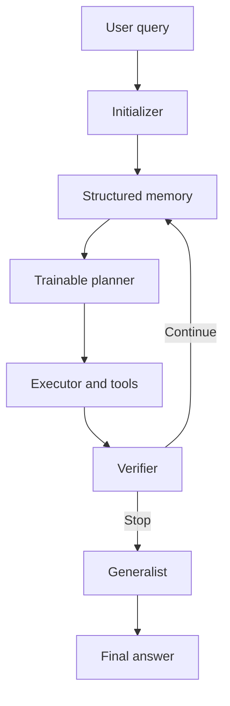

# Multi-Turn Agent Reinforcement Learning with OpenRLHF

<p align="center">
  <strong>A lightweight, AgentFlow-inspired approach to training structured multi-turn agents without rewriting the OpenRLHF training stack.</strong>
</p>

## Contents

- [Overview](#overview)
- [Motivation](#motivation)
- [Preliminaries](#preliminaries)
- [System Architecture](#system-architecture)
- [How the Agent Loop Works](#how-the-agent-loop-works)
- [Training with Trajectory-Level Rewards](#training-with-trajectory-level-rewards)
- [Prompt and State Design](#prompt-and-state-design)
- [Integration with OpenRLHF](#integration-with-openrlhf)
- [Benefits and Trade-offs](#benefits-and-trade-offs)
- [Repository Layout](#repository-layout)
- [Quick Start](#quick-start)
- [Evaluation Recommendations](#evaluation-recommendations)
- [Limitations and Future Work](#limitations-and-future-work)
- [Related Work](#related-work)

---

## Overview

This repository explores how to train a multi-turn, tool-using agent with OpenRLHF while preserving the modular structure of an agentic system.

The project began as an attempt to implement [AgentFlow](https://arxiv.org/abs/2510.05592) as a generic plugin inside OpenRLHF. A simpler design emerged during implementation: keep the distributed RL training framework largely unchanged and express the agent workflow through a lightweight rollout environment.

The resulting design combines:

- **AgentFlow-inspired role separation** in `agentflow/`:
  `Initializer -> Planner -> Executor -> Verifier -> Generalist`.
- **OpenRLHF-based policy optimization** in `openrlhf_agent/`.
- **Training entry points and examples** in `train/` and `scripts/`.
- **Structured working memory** that records goals, actions, observations, verification results, and unresolved questions across turns.

Only the planner is intended to be optimized by reinforcement learning. The remaining modules and external tools form the environment in which the planner acts.

> [!NOTE]
> This repository is inspired by AgentFlow; it is not intended to be a byte-for-byte reproduction of the original implementation. The goal is to demonstrate a small, understandable integration pattern for agentic RL in OpenRLHF.

## Motivation

A conventional tool-using language model often performs several responsibilities through one policy and one growing conversation:

- understand the request;
- decide the next step;
- select and call a tool;
- inspect the result;
- determine whether to continue;
- produce the final answer.

This approach is flexible, but long trajectories can become difficult to train and debug. The model must infer its current role from a flat context, tool observations continually change the state distribution, and a mistake early in the trajectory may produce unfamiliar states later.

A modular agent system separates these responsibilities. The planner concentrates on high-level decisions, while specialized components execute commands, validate progress, and write the final response. Reinforcement learning can then target the coordination bottleneck: **what the system should do next**.

The central hypothesis of this project is:

> A structured agent workflow can be trained using an existing multi-turn RL infrastructure if the workflow is represented as an environment around a trainable planner policy.

## Preliminaries

### Multi-turn agent reinforcement learning

A multi-turn rollout alternates between a policy and an environment:

```text
state_1 -> planner_action_1 -> environment_observation_1
        -> state_2 -> planner_action_2 -> environment_observation_2
        -> ... -> final_answer -> reward
```

At turn `t`:

- the **state** contains the user request, available tools, and working memory;
- the **planner action** specifies a sub-goal, selected tool, and relevant context;
- the **environment observation** contains the executor result and verifier feedback;
- the **terminal reward** measures whether the final answer solved the task.

The observations are not policy actions and should not receive policy-gradient updates. This distinction is important when constructing token masks, log-probabilities, and trajectory rewards.

### On-policy learning

Offline supervised fine-tuning learns from states produced by a teacher or collected earlier. During deployment, however, an agent encounters states caused by its own decisions: malformed calls, empty search results, conflicting evidence, and partially completed plans.

On-policy training rolls out the current planner inside the live workflow. It therefore trains the planner on the state distribution it is likely to encounter at inference time, including failure and recovery states.

### Structured working memory

Working memory is the explicit state shared by the modules. A useful memory entry contains at least:

```text
turn
sub_goal
selected_tool
tool_arguments
tool_result
verification_status
open_questions
errors
```

Structured memory is not automatically shorter than a transcript. Its advantage is control: fields can be selected, summarized, deduplicated, or protected independently. For example, old tool outputs may be compressed while the original user constraints remain unchanged.

### Hierarchical-RL interpretation

The architecture can also be understood as a simple hierarchical policy:

| Hierarchical-RL concept | Component in this project |
| --- | --- |
| High-level policy | Planner |
| Option or skill | Tool or auxiliary module |
| Option arguments | Sub-goal and tool context |
| State or belief state | Structured memory |
| Option observation | Tool execution result |
| Termination rule | Verifier |
| Episode return | Final task reward |

The planner learns option selection and parameterization; the executor and tools implement the options.

## System Architecture



### Module responsibilities

| Module | Responsibility | Trainable by RL? |
| --- | --- | --- |
| Initializer | Analyze the request, identify constraints, and initialize memory | No |
| Planner | Choose one achievable sub-goal, select a tool, and supply the required context | **Yes** |
| Executor | Convert the plan into a valid command and invoke the selected tool | No |
| Verifier | Check correctness and completeness; decide `CONTINUE` or `STOP` | No |
| Generalist | Synthesize the final answer from the query and accumulated evidence | No |
| Tools | Search, calculate, retrieve, or interact with an external environment | No |

The modules may use separate models, the same frozen model with different prompts, deterministic code, or a mixture of these implementations. Role separation is an interface decision, not necessarily a requirement to deploy five different neural networks.

## How the Agent Loop Works

The inference and rollout algorithm is:

1. **Initialize.** Parse the user query and create structured memory containing the objective, constraints, and available tools.
2. **Plan.** The trainable planner reads the current memory and emits one next-step action:
   - justification;
   - context;
   - sub-goal;
   - tool name.
3. **Execute.** The executor validates the proposed tool and arguments, invokes the tool, and captures its result or error.
4. **Record.** Append the sub-goal, call, observation, and relevant metadata to memory.
5. **Verify.** Determine whether the evidence is correct and sufficient.
6. **Continue or stop.** If the verifier returns `CONTINUE`, construct the next planner state from updated memory. If it returns `STOP`, leave the loop.
7. **Generate.** The generalist produces a final answer grounded in the accumulated evidence.
8. **Score.** A task-specific verifier or reward function evaluates the final answer.

### Pseudocode

```text
function run_agent(query, tools, planner):
    memory = initializer(query, tools)
    planner_actions = []

    for turn in 1..max_turns:
        state = build_planner_state(query, tools, memory)
        action = planner.generate(state)
        planner_actions.append(action)

        execution = executor.run(action, tools)
        decision = verifier.check(query, memory, action, execution)
        memory = update_memory(memory, action, execution, decision)

        if decision == STOP:
            break

    answer = generalist.generate(query, memory)
    reward = evaluate(query, answer)

    return planner_actions, memory, answer, reward
```

Two invariants make the loop easier to train:

- The planner selects exactly one bounded action per turn.
- The environment, rather than the policy, owns tool execution and state transitions.

## Training with Trajectory-Level Rewards

### Optimization boundary

Although a rollout contains text produced by several modules, the planner is the policy being optimized. A training sample should therefore distinguish:

```text
planner-generated tokens       -> included in the policy loss
tool and environment tokens    -> context only
verifier and generator tokens  -> context or terminal output only
```

The precise representation depends on the OpenRLHF version and rollout API, but the principle is stable: environment observations must not be mistaken for sampled policy actions.

### AgentFlow and Flow-GRPO

The original AgentFlow paper trains its planner with Flow-GRPO:

1. Sample a group of complete on-policy trajectories for the same query.
2. Score each final answer with a trajectory-level reward `R_i`.
3. Normalize rewards within the group:

   ```text
   A_i = (R_i - mean(R_1 ... R_G)) / (std(R_1 ... R_G) + epsilon)
   ```

4. Assign the trajectory advantage `A_i` to every planner action in trajectory `i`.
5. Optimize planner tokens with a clipped PPO-style objective and KL regularization.

Broadcasting the terminal reward provides a simple learning signal for all planner turns without requiring hand-authored step rewards. It is practical, but it does not identify which individual action caused success or failure. Long-horizon extensions may benefit from a critic, progress rewards, counterfactual evaluation, or learned turn-level credit assignment.

### Why online rollouts matter

The planner should be trained inside the same loop used for inference:

```text
current planner
    -> current action
    -> real executor/tool result
    -> verifier decision
    -> updated memory
    -> next planner action
```

This reduces the mismatch between training states and deployment states. It also lets the policy learn recovery behaviors, such as reformulating a failed query, switching tools after weak evidence, or stopping when further calls are unnecessary.

### Reward design

Start with the most reliable outcome verifier available:

- exact-match or unit-test reward for mathematics and code;
- structured-field comparison for extraction tasks;
- environment success signal for interactive tasks;
- carefully calibrated model-based judging only when deterministic verification is unavailable.

For practical agents, a cost-aware reward may be preferable:

```text
total_reward = task_success
             - lambda_calls * number_of_tool_calls
             - lambda_tokens * generated_tokens
             - lambda_errors * invalid_tool_calls
```

Do not add cost penalties until the task-success signal is working reliably; otherwise the easiest learned behavior may be to stop immediately.

## Prompt and State Design

### Conventional flat-history prompting

A conventional multi-turn agent may repeatedly append every instruction, action, and observation:

```text
system instructions
user query
assistant analysis
tool call
tool result
assistant analysis
tool call
tool result
...
```

This design is simple and preserves the complete record, but long contexts may contain duplicated instructions, irrelevant observations, and ambiguous role transitions.

### Role-specific prompting with structured memory

This project derives a role-specific prompt from shared memory. The planner receives planning instructions and selected state fields; the verifier receives evidence and completion criteria; the generalist receives the information needed to construct the answer.

An abbreviated planner prompt is:

```text
Task: Select the best next step for the current query.

Query: {question}
Available tools: {available_tools}
Tool metadata: {toolbox_metadata}
Previous steps: {memory}

Return:
1. Justification
2. Context required by the tool
3. One achievable sub-goal
4. Exact tool name
```

An abbreviated verifier prompt is:

```text
Task: Decide whether the accumulated evidence is sufficient and correct.

Query: {question}
Constraints: {constraints}
Memory: {memory}

Check:
- unanswered sub-questions;
- contradictions or unsupported claims;
- tool errors or ambiguous evidence;
- whether another tool call is likely to help.

End with exactly one of:
Conclusion: STOP
Conclusion: CONTINUE
```

### Flat context versus structured state

| Property | Flat multi-turn context | Structured agent state |
| --- | --- | --- |
| Initial implementation | Simpler | More engineering |
| Role boundaries | Usually implicit | Explicit |
| Full trace preservation | Natural | Requires a schema |
| Selective compaction | Difficult | Field-level control |
| Debugging | Conversation inspection | Module and state inspection |
| Prefix/KV-cache reuse | Often better | May be reduced by prompt transformation |
| Schema failure risk | Low | Parsing and migration must be handled |

These approaches are not mutually exclusive. A robust implementation can retain an immutable event log for auditability while deriving compact, structured views for individual modules.

## Integration with OpenRLHF

The preferred integration boundary is the agent rollout function, not invasive changes to the optimizer.

At a conceptual level, the rollout adapter should:

1. Receive a dataset prompt and initialize the agent state.
2. Ask the current policy for a planner action.
3. Run auxiliary modules and tools outside the trainable policy.
4. Build the next policy prompt from updated memory.
5. Repeat until `STOP` or `max_turns`.
6. Produce the final task reward.
7. Return the policy-generated token spans, masks, log-probability information, and reward in the format expected by the trainer.

This keeps responsibilities clean:

| Layer | Owns |
| --- | --- |
| OpenRLHF | Distributed sampling, reference policy, optimization, checkpointing, and model serving |
| Agent rollout | Module orchestration, memory, tools, termination, and task reward |
| Task environment | Tool semantics, external state, and success criteria |

Recent OpenRLHF versions expose agent-oriented rollout hooks such as `agent_func_path`. This repository also contains `openrlhf_agent/` for the compatibility changes and bug fixes used by this implementation. Check the local scripts before assuming that commands or configuration fields match the latest upstream release.

### Implementation checklist

- Keep policy-generated token spans separate from environment observations.
- Preserve the exact prompt used to obtain each action's old log-probabilities.
- Apply the final trajectory reward consistently to the intended planner actions.
- Enforce maximum turns, output lengths, and tool timeouts.
- Validate structured outputs before executing commands.
- Record failed calls as observations so that the planner can learn recovery.
- Isolate code execution and untrusted tools in a sandbox.
- Log per-turn state, action, observation, latency, and reward for debugging.

## Benefits and Trade-offs

### Benefits

- **Natural responsibility separation.** Planning, execution, verification, and answer generation have explicit contracts.
- **Focused optimization.** RL targets the high-level coordination policy instead of requiring every component to change simultaneously.
- **Inspectable state.** Structured memory makes failures and repeated actions easier to diagnose.
- **Controlled compaction.** Large tool results can be summarized without rewriting user constraints or verified facts.
- **Replaceable tools.** Stable tool interfaces allow executors or underlying models to be upgraded independently.
- **Better recovery training.** On-policy rollouts expose the planner to states created by its own mistakes.

### Trade-offs

- **More engineering.** The system needs schemas, parsers, module contracts, state updates, and error handling.
- **Higher inference cost.** Auxiliary model calls and reduced prefix reuse can increase latency and GPU usage.
- **Reward ambiguity.** A terminal reward applied to every turn does not provide causal turn-level credit.
- **Non-stationarity.** Simultaneously training several modules would continually change the planner's environment.
- **Verifier dependence.** Incorrect stopping or weak verification can cap the performance of the entire system.
- **Context is still finite.** Structured memory delays context growth but does not eliminate the need for retrieval or compaction.

For short, simple trajectories, a monolithic multi-turn policy may be the better engineering choice. Modular agent training becomes more attractive as the number of tools, trajectory length, failure modes, and need for observability increase.

## Repository Layout

```text
.
├── agentflow/          # Agent roles, solver loop, memory, engines, and tools
├── openrlhf_agent/     # OpenRLHF integration and local compatibility fixes
├── train/              # Training entry points and example agent environments
├── scripts/            # Launch scripts for common training configurations
├── pyproject.toml      # Python project configuration
└── README.md
```

## Quick Start

### 1. Install dependencies

```bash
uv sync
```

### 2. Run the minimal example

```bash
python3 train/quick_start.py
```

### 3. Inspect the rollout before training

Before launching distributed RL, verify that a single example:

- initializes all required memory fields;
- produces a valid planner action;
- invokes the expected tool;
- records tool errors without crashing;
- obeys the maximum-turn limit;
- terminates only when the verifier returns `STOP`;
- emits a final answer and reward;
- marks only planner-generated tokens as policy actions.

> [!IMPORTANT]
> Tool-using RL executes model-generated actions repeatedly and at scale. Run code, shell, browser, and filesystem tools in an appropriately isolated environment. Do not expose production credentials or unrestricted host access to rollout workers.

## Evaluation Recommendations

Final accuracy alone is insufficient for diagnosing an agentic policy. Track at least:

| Metric | What it reveals |
| --- | --- |
| Task success | Whether the complete system solves the task |
| Success by turn budget | Whether longer reasoning actually helps |
| Tool-selection accuracy | Whether the planner routes tasks appropriately |
| Invalid-call rate | Whether actions respect tool schemas |
| Recovery rate | Whether the planner can recover after a failed observation |
| Premature-stop rate | Whether the verifier ends incomplete trajectories |
| Redundant-call rate | Whether the planner repeats low-value actions |
| Tokens, calls, and latency | The cost of improved task performance |

Recommended ablations include:

- frozen planner versus RL-trained planner;
- flat history versus structured memory;
- terminal reward versus progress-aware or critic-based credit;
- planner-only training versus training additional modules;
- original tools versus upgraded or perturbed tools;
- seen tools versus tools introduced only at evaluation time;
- equal-compute comparison with a monolithic multi-turn policy.

## Limitations and Future Work

This implementation is a research prototype. Important open directions include:

- **Better credit assignment:** estimate which turns contributed to success instead of rewarding every action equally.
- **Learned termination:** combine verifier judgments with uncertainty and expected value of another tool call.
- **Cost-aware planning:** optimize task success jointly with latency, tool cost, and token usage.
- **Memory management:** learn what to retain, retrieve, summarize, or forget while preserving user constraints.
- **Tool generalization:** represent tools by capabilities and schemas so that newly introduced tools can be used with minimal retraining.
- **Stable multi-module learning:** train planner, verifier, and executor at different timescales to reduce non-stationarity.
- **Continual learning:** preserve general planning skills while adapting to new environments and updated tools.
- **Safer execution:** strengthen sandboxing, permission boundaries, and adversarial tool-output handling.

## Related Work

- **[AgentFlow: In-the-Flow Agentic System Optimization for Effective Planning and Tool Use](https://arxiv.org/abs/2510.05592)** introduces a planner–executor–verifier–generator system and trains the planner on-policy with Flow-GRPO inside the live multi-turn workflow. See also the [official implementation](https://github.com/lupantech/AgentFlow).
- **[OpenRLHF](https://github.com/OpenRLHF/OpenRLHF)** provides a scalable Ray-, DeepSpeed-, and vLLM-based RLHF and agentic-RL training stack. This repository uses OpenRLHF as the optimization backbone.
- **[Search-R1](https://arxiv.org/abs/2503.09516)** and related tool-integrated reasoning methods train a policy to interleave reasoning with external search under outcome rewards.
- **[ToRL](https://arxiv.org/abs/2503.23383)** studies reinforcement learning for tool-integrated mathematical reasoning with code execution.
- **[AutoGen](https://arxiv.org/abs/2308.08155)** demonstrates modular, conversational multi-agent orchestration, generally without end-to-end on-policy training of the coordination policy.
- **[MARTI](https://github.com/TsinghuaC3I/MARTI)** explores centralized multi-agent interaction with distributed reinforcement-learning training in an OpenRLHF-derived system.

When citing the main inspiration for this project, please use the citation provided by the AgentFlow authors:

```bibtex
@inproceedings{li2026flow,
  title     = {In-the-Flow Agentic System Optimization for Effective Planning and Tool Use},
  author    = {Li, Zhuofeng and Zhang, Haoxiang and Han, Seungju and Liu, Sheng and
               Xie, Jianwen and Zhang, Yu and Choi, Yejin and Zou, James and Lu, Pan},
  booktitle = {International Conference on Learning Representations},
  year      = {2026}
}
```

---

<p align="center">
  Built for practical research on reinforcement-learning-powered autonomous agents.
</p>
